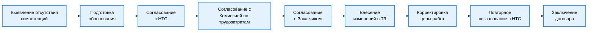
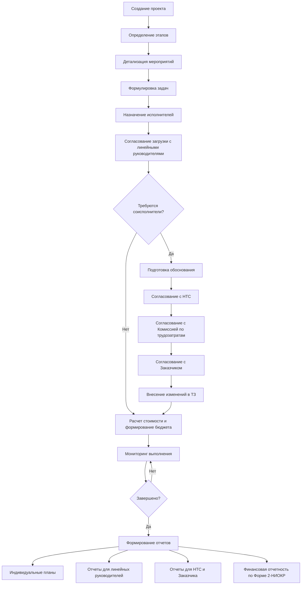
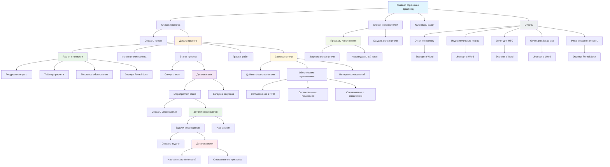

# SciMaster: Система управления научно-исследовательскими и опытно-конструкторскими работами


## 🎯 Назначение системы

**SciMaster** — это специализированная информационная система для научных руководителей, предназначенная для планирования научно-исследовательских (НИР), опытно-конструкторских работ (ОКР) и услуг. Система обеспечивает комплексное управление проектами: от постановки задач и распределения ресурсов до расчета стоимости и формирования бюджетной документации в соответствии с Формой 2-НИОКР ОПК.

**Ключевая особенность:** Система используется исключительно научным руководителем для планирования, мониторинга и расчета бюджетов. Исполнители не работают непосредственно в системе — руководитель вносит прогресс на основе внешних коммуникаций.

## ✨ Ключевые возможности

- **Иерархическое управление работами:** Проекты → Этапы → Мероприятия → Задачи
- **Управление командой:** Назначение исполнителей с указанием должностей
- **Расчет стоимости работ:** Автоматизированный расчет трудоемкости, затрат и прибыли
- **Интеграция с Формой 2-НИОКР ОПК:** Формирование полного пакета бюджетной документации
- **Учет субподрядчиков:** Управление внешними соисполнителями с процедурой согласования
- **Визуализация прогресса:** Дашборды, графики работ, контроль сроков
- **Формирование отчетности:** Экспорт индивидуальных планов и отчетных документов в Word

## 🏢 Организационный контекст и процесс согласований

### Учет организационной структуры
- Каждый исполнитель имеет назначенного линейного руководителя
- Вопросы загрузки специалистов согласуются с линейными руководителями
- Многоуровневая процедура согласования привлечения соисполнителей

### Процедура привлечения соисполнителей


## 👨‍💼 Процесс работы научного руководителя в системе

### 1. Создание и структурирование работы
```
Научная работа (НИР/ОКР/Услуга)
    └── Этап 1: Подготовительный этап
        └── Мероприятие 1.1: Анализ литературы
            └── Задача 1.1.1: Подбор источников
            └── Задача 1.1.2: Анализ методов
    └── Этап 2: Экспериментальный этап
        └── Мероприятие 2.1: Проведение экспериментов
            └── Задача 2.1.1: Подготовка оборудования
            └── Задача 2.1.2: Серия экспериментов
```

### 2. Назначение исполнителей с учетом организационной иерархии
- Назначение исполнителей с указанием должности
- Учет текущей загрузки сотрудников across projects
- Фиксация линейного руководителя каждого исполнителя
- Формирование предварительного плана загрузки для согласования

### 3. Расчет стоимости и формирование бюджетной документации
- **Определение ресурсов:** Назначение исполнителей автоматически определяет трудоемкость
- **Расчет затрат:** Автоматический расчет:
  - Затрат на оплату труда (на основе трудоемкости и стоимости специалиста)
  - Отчислений на социальные нужды (норматив 30,6%)
  - Накладных расходов (норматив 250% от ФОТ)
  - Себестоимости и прибыли (норматив 15%)
- **Распределение по годам:** Заполнение таблиц по форме 2-НИОКР с распределением затрат по годам
- **Формирование обоснования:** Генерация текстовых разделов формы (цель, актуальность, ожидаемые результаты)

### 4. Процедура согласования привлечения соисполнителей
- Формирование обоснования необходимости привлечения сторонних организаций
- Подготовка документов для согласования с НТС
- Подготовка расчетов для Комиссии по трудозатратам
- Формирование пакета документов для заказчика (ФОИВ)

### 5. Мониторинг прогресса и корректировка планов
- Регулярное обновление статуса задач на основе отчетов исполнителей
- Визуализация прогресса по проекту и по каждому исполнителю
- Контроль соблюдения сроков
- Внесение корректировок с учетом изменений внешних условий

### 6. Формирование отчетности
- Генерация индивидуальных планов для исполнителей в формате Word
- Подготовка отчетов для линейных руководителей о загрузке подчиненных
- Формирование документов для НТС и Комиссии по трудозатратам
- Подготовка отчетности для заказчика (ФОИВ)

## 📊 Визуализация рабочего процесса



## 🗄 Структура данных

### Основные сущности системы:

1. **Проект (НИР/ОКР/Услуга)**
   - Название, тип, сроки, описание
   - Научный руководитель, статус выполнения
   - Информация о заказчике (ФОИВ)

2. **Этап**
   - Последовательные стадии выполнения проекта
   - Сроки, приоритет, связь с мероприятиями

3. **Мероприятие**
   - Конкретные действия в рамках этапа
   - Ответственные исполнители, плановые и фактические сроки

4. **Задача**
   - Конкретные поручения исполнителям
   - Сроки, приоритет, статус выполнения
   - Связь с исполнителями и линейными руководителями

5. **Исполнитель**
   - ФИО, должность, квалификация
   - Текущая загрузка проектами, линейный руководитель

6. **Субподрядчик**
   - Организация, реквизиты, контакты
   - Обоснование привлечения
   - История согласований (НТС, Комиссия, Заказчик)
   - Составные части работ

7. **Статьи затрат (CostItem)**
   - Тип затрат (Оплата труда, Материалы, Оборудование, Накладные расходы)
   - Плановое значение (руб.), статья сметы

8. **Профиль затрат специалиста (EmployeeCostProfile)**
   - Связь с Исполнителем, должность
   - Средняя стоимость рабочего времени (руб./мес.)

9. **Расчет стоимости (CostCalculation)**
   - Связь с Проектом и Этапами
   - Трудоемкость, суммарные затраты на оплату труда
   - Затраты на материалы и оборудование
   - Расчет накладных расходов, себестоимости, прибыли
   - Итоговая цена

10. **Процедуры согласования**
    - Протоколы НТС, решения Комиссии по трудозатратам
    - Письма заказчика (ФОИВ), изменения в техническом задании

## 📋 Пример использования

1. **Создание нового проекта НИР**
   - Регистрация основных параметров проекта
   - Определение этапов и сроков
   - Указание заказчика (ФОИВ)

2. **Детализация мероприятий и назначение исполнителей**
   - Разбиение этапов на конкретные мероприятия
   - Назначение исполнителей с учетом их компетенций
   - Согласование загрузки с линейными руководителями

3. **Расчет стоимости работ**
   - Автоматический расчет трудоемкости на основе назначенных исполнителей
   - Заполнение статей затрат на материалы и оборудование
   - Формирование таблиц по Форме 2-НИОКР ОПК
   - Расчет себестоимости и прибыли

4. **Выявление необходимости привлечения соисполнителей**
   - Фиксация отсутствия необходимых компетенций
   - Подготовка обоснования привлечения субподрядчика
   - Прохождение процедуры согласования (НТС, Комиссия, Заказчик)

5. **Мониторинг выполнения и корректировка планов**
   - Еженедельное обновление статусов задач
   - Контроль соблюдения сроков
   - Внесение изменений в планы при необходимости

6. **Формирование отчетности**
   - Генерация индивидуальных планов для сотрудников
   - Подготовка отчетов для линейных руководителей
   - Формирование документов для НТС и заказчика
   - Экспорт финансовой отчетности по Форме 2-НИОКР

## 🎨 Интерфейс системы

### Основные экраны:

1. **Дашборд проектов**
   - Список всех проектов с индикацией статуса
   - Визуализация загрузки исполнителей
   - Отображение текущих процедур согласования

2. **Детальная страница проекта**
   - Иерархическое отображение этапов, мероприятий и задач
   - Блок информации о согласованиях и решениях НТС
   - Раздел для работы с субподрядчиками

3. **Модуль расчета стоимости ("Смета")**
   - Вкладка "Ресурсы и затраты" для ввода статей затрат
   - Вкладка "Расчет" с автоматическим формированием таблиц по форме 2-НИОКР
   - Вкладка "Обоснование" для заполнения текстовых разделов формы
   - Кнопка "Экспорт в Word" для генерации готового документа

4. **Модуль согласований**
   - Шаблоны документов для НТС и Комиссии по трудозатратам
   - История согласований по каждому проекту
   - Напоминания о сроках получения согласований

5. **Редактор исполнителей**
   - Список всех сотрудников с указанием должностей
   - Информация о линейных руководителях
   - Просмотр текущей загрузки каждого исполнителя

6. **Генератор отчетов**
   - Формирование индивидуальных планов в Word
   - Подготовка документов для согласующих инстанций
   - Настройка шаблонов отчетных документов

## 📝 Формирование документации

### Индивидуальные планы исполнителей:
- Перечень назначенных задач с сроками выполнения
- Приоритеты задач, текущий статус выполнения
- Сводная информация по загрузке

### Документы для согласующих инстанций:
- Обоснование привлечения соисполнителей
- Расчеты трудозатрат и стоимости работ
- Проекты изменений в техническое задание
- Информационные карты для НТС и Комиссии

### Финансовая документация по Форме 2-НИОКР ОПК:
- Таблица 1. План работ и стоимость по этапам
- Расчет стоимости этапов
- Оценка начальной (максимальной) стоимости контракта
- Текстовые разделы обоснования (цель, актуальность, ожидаемые результаты)

## 🔧 Технические особенности

- **Локальная установка:** Система работает на компьютере научного руководителя
- **Простота использования:** Минималистичный интерфейс без избыточных функций
- **Гибкость:** Возможность адаптации структуры работ под конкретные нужды
- **Конфиденциальность:** Все данные хранятся локально без внешних серверов
- **Соответствие регламентам:** Учет требований официальных процедур согласования
- **Интеграция с Word:** Экспорт документов в формате .docx для дальнейшего редактирования

## 📊 Схема взаимодействия страниц



## ❓ Часто задаваемые вопросы

**Вопрос:** Как система учитывает организационную иерархию при распределении задач?
**Ответ:** Система содержит информацию о линейных руководителях исполнителей и обеспечивает предварительное согласование планов загрузки перед назначением задач.

**Вопрос:** Какие документы система готовит для согласования привлечения соисполнителей?
**Ответ:** Система формирует полный пакет документов, включая обоснование необходимости привлечения, расчеты трудозатрат, проекты изменений в ТЗ и другие материалы, требуемые регламентом.

**Вопрос:** Как учитываются решения согласующих органов (НТС, Комиссии, Заказчика)?
**Ответ:** В системе ведется полная история согласований с возможностью прикрепления сканов решений, протоколов и писем, что обеспечивает документирование всего процесса.

**Вопрос:** Поддерживает ли система расчет стоимости по Форме 2-НИОКР ОПК?
**Ответ:** Да, система автоматически рассчитывает все показатели формы: трудоемкость, затраты на оплату труда, накладные расходы, себестоимость и прибыль. Результаты экспортируются в готовый документ Word.

**Вопрос:** Можно ли импортировать данные из других систем?
**Ответ:** В текущей версии импорт не предусмотрен, но эта возможность может быть добавлена при необходимости.

---

*SciMaster: эффективное планирование научных работ с учетом организационных процедур и требований согласующих инстанций. Комплексное управление задачами, ресурсами и бюджетом НИОКР.*