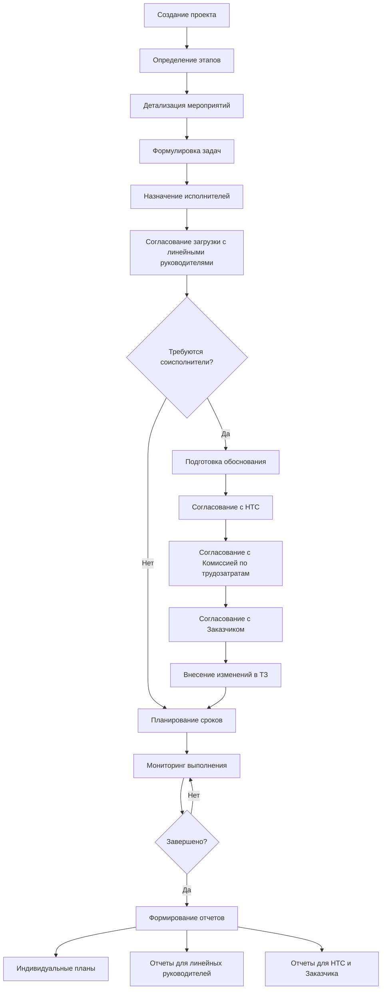
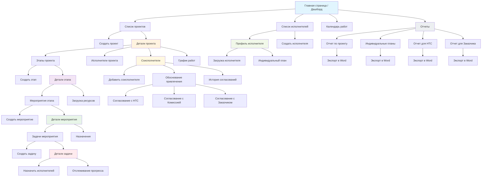

# SciMaster: Система планирования НИОКР для научного руководителя

## 🎯 Назначение системы

**SciMaster** — это специализированная информационная система для научных руководителей, предназначенная для планирования научно-исследовательских (НИР) и опытно-конструкторских работ (ОКР). Система обеспечивает структурирование работ, распределение задач между исполнителями и формирование индивидуальных планов сотрудников с учетом организационной иерархии и процедур согласования.

**Ключевая особенность:** Система используется исключительно научным руководителем для планирования и мониторинга. Исполнители не работают непосредственно в системе — руководитель вносит прогресс на основе внешних коммуникаций.

## 🏢 Организационный контекст и процесс согласований

### Учет организационной структуры
- Каждый исполнитель имеет назначенного линейного руководителя
- Вопросы загрузки специалистов согласуются с линейными руководителями
- Принятие решений о привлечении соисполнителей проходит многоуровневую процедуру согласования

### Процедура привлечения соисполнителей
```mermaid
graph TD
    A[Выявление отсутствия необходимых компетенций] --> B[Подготовка обоснования привлечения соисполнителя];
    B --> C[Согласование с Научно-техническим советом (НТС)];
    C --> D[Согласование с Комиссией по трудозатратам];
    D --> E[Согласование с Заказчиком (ФОИВ)];
    E --> F[Внесение изменений в техническое задание];
    F --> G[Корректировка структуры цены работ];
    G --> H[Повторное согласование с НТС];
    H --> I[Заключение договора с соисполнителем];
```

## 👨‍💼 Процесс работы научного руководителя в системе

### 1. Создание и структурирование работы
```
Научная работа (НИР/ОКР/Услуга)
    └── Этап 1: Подготовительный этап
        └── Мероприятие 1.1: Анализ литературы
            └── Задача 1.1.1: Подбор источников
            └── Задача 1.1.2: Анализ методов
    └── Этап 2: Экспериментальный этап
        └── Мероприятие 2.1: Проведение экспериментов
            └── Задача 2.1.1: Подготовка оборудования
            └── Задача 2.1.2: Серия экспериментов
```

### 2. Назначение исполнителей с учетом организационной иерархии
- Для каждой задачи назначаются исполнители с указанием должности
- Учитывается текущая загрузка сотрудников across projects
- Фиксируется линейный руководитель каждого исполнителя
- Формируется предварительный план загрузки для согласования

### 3. Процедура согласования привлечения соисполнителей
- Формирование обоснования необходимости привлечения сторонних организаций
- Подготовка документов для согласования с НТС
- Подготовка расчетов для Комиссии по трудозатратам
- Формирование пакета документов для заказчика (ФОИВ)

### 4. Мониторинг прогресса и корректировка планов
- Регулярное обновление статуса задач на основе отчетов исполнителей
- Визуализация прогресса по проекту в целом и по каждому исполнителю
- Контроль соблюдения сроков
- Внесение корректировок с учетом изменений внешних условий

### 5. Формирование отчетности
- Генерация индивидуальных планов для исполнителей в формате Word
- Подготовка отчетов для линейных руководителей о загрузке подчиненных
- Формирование документов для НТС и Комиссии по трудозатратам
- Подготовка отчетности для заказчика (ФОИВ)

## 📊 Визуализация рабочего процесса с учетом организационных процедур



## 🗄 Структура данных с учетом организационных требований

### Основные сущности системы:

1. **Проект (НИР/ОКР/Услуга)**
   - Название, тип, сроки, описание
   - Научный руководитель
   - Статус выполнения
   - Информация о заказчике (ФОИВ)

2. **Этап**
   - Последовательные стадии выполнения проекта
   - Сроки и приоритет каждого этапа
   - Связь с мероприятиями

3. **Мероприятие**
   - Конкретные действия в рамках этапа
   - Ответственные исполнители
   - Плановые и фактические сроки

4. **Задача**
   - Конкретные поручения исполнителям
   - Сроки, приоритет, статус выполнения
   - Связь с исполнителями и линейными руководителями

5. **Исполнитель**
   - ФИО, должность, квалификация
   - Текущая загрузка проектами
   - Линейный руководитель

6. **Субподрядчик**
   - Организация, реквизиты, контакты
   - Обоснование привлечения
   - История согласований (НТС, Комиссия, Заказчик)
   - Составные части работ

7. **Процедуры согласования**
   - Протоколы НТС
   - Решения Комиссии по трудозатратам
   - Письма заказчика (ФОИВ)
   - Изменения в техническом задании

## 📋 Пример использования с учетом организационных процедур

1. **Создание нового проекта НИР**
   - Регистрация основных параметров проекта
   - Определение этапов и сроков
   - Указание заказчика (ФОИВ)

2. **Детализация мероприятий и назначение исполнителей**
   - Разбиение этапов на конкретные мероприятия
   - Назначение исполнителей с учетом их компетенций
   - Согласование загрузки с линейными руководителями

3. **Выявление необходимости привлечения соисполнителей**
   - Фиксация отсутствия необходимых компетенций
   - Подготовка обоснования привлечения субподрядчика
   - Прохождение процедуры согласования (НТС, Комиссия, Заказчик)

4. **Мониторинг выполнения и корректировка планов**
   - Еженедельное обновление статусов задач
   - Контроль соблюдения сроков
   - Внесение изменений в планы при необходимости

5. **Формирование отчетности**
   - Генерация индивидуальных планов для сотрудников
   - Подготовка отчетов для линейных руководителей
   - Формирование документов для НТС и заказчика

## 🎨 Интерфейс системы с учетом официальных требований

### Основные экраны:

1. **Дашборд проектов**
   - Список всех проектов с индикацией статуса
   - Визуализация загрузки исполнителей
   - Отображение текущих процедур согласования

2. **Детальная страница проекта**
   - Иерархическое отображение этапов, мероприятий и задач
   - Блок информации о согласованиях и решениях НТС
   - Раздел для работы с субподрядчиками

3. **Модуль согласований**
   - Шаблоны документов для НТС и Комиссии по трудозатратам
   - История согласований по каждому проекту
   - Напоминания о сроках получения согласований

4. **Редактор исполнителей**
   - Список всех сотрудников с указанием должностей
   - Информация о линейных руководителях
   - Просмотр текущей загрузки каждого исполнителя

5. **Генератор отчетов**
   - Формирование индивидуальных планов в Word
   - Подготовка документов для согласующих инстанций
   - Настройка шаблонов отчетных документов

## 📝 Формирование индивидуальных планов и отчетных документов

Для каждого исполнителя система формирует план работ, включающий:
- Перечень назначенных задач с сроками выполнения
- Приоритеты задач
- Текущий статус выполнения
- Сводную информацию по загрузке

Для согласующих инстанций система готовит пакеты документов:
- Обоснование привлечения соисполнителей
- Расчеты трудозатрат и стоимости работ
- Проекты изменений в техническое задание
- Информационные карты для НТС и Комиссии

## 🔧 Технические особенности

- **Локальная установка**: Система работает на компьютере научного руководителя
- **Простота использования**: Минималистичный интерфейс без избыточных функций
- **Гибкость**: Возможность адаптации структуры работ под конкретные нужды
- **Конфиденциальность**: Все данные хранятся локально без внешних серверов
- **Соответствие регламентам**: Учет требований официальных процедур согласования

## ❓ Часто задаваемые вопросы

**Вопрос:** Как система учитывает организационную иерархию при распределении задач?
**Ответ:** Система содержит информацию о линейных руководителях исполнителей и обеспечивает предварительное согласование планов загрузки перед назначением задач.

**Вопрос:** Какие документы система готовит для согласования привлечения соисполнителей?
**Ответ:** Система формирует полный пакет документов, включая обоснование необходимости привлечения, расчеты трудозатрат, проекты изменений в ТЗ и другие материалы, требуемые регламентом.

**Вопрос:** Как учитываются решения согласующих органов (НТС, Комиссии, Заказчика)?
**Ответ:** В системе ведется полная история согласований с возможностью прикрепления сканов решений, протоколов и писем, что обеспечивает документирование всего процесса.

**Вопрос:** Можно ли импортировать данные из других систем?
**Ответ:** В текущей версии импорт не предусмотрен, но эта возможность может быть добавлена при необходимости.

---

*SciMaster: эффективное планирование научных работ с учетом организационных процедур и требований согласующих инстанций*

# Схема взаимодействия страниц приложения SciMaster



## Описание ключевых страниц и их взаимодействия

### 1. **Главная страница / Дашборд**
- Центральный узел навигации
- Краткая сводка по всем активным проектам
- Статистика загрузки исполнителей
- Ближайшие deadlines

### 2. **Страницы проекта**
- **Детали проекта**: основная информация, сроки, статус
- **Этапы проекта**: иерархическое представление структуры работ
- **Исполнители**: распределение нагрузки по проекту
- **Соисполнители**: управление внешними контрагентами
- **График работ**: визуализация сроков выполнения

### 3. **Страницы этапов и мероприятий**
- Детализация работ до уровня конкретных задач
- Назначение ответственных исполнителей
- Контроль сроков выполнения

### 4. **Управление исполнителями**
- Профили сотрудников с информацией о должностях
- Просмотр текущей загрузки
- Формирование индивидуальных планов работ

### 5. **Работа с соисполнителями**
- Процедура обоснования привлечения
- История согласований с НТС, Комиссией и Заказчиком
- Управление договорными отношениями

### 6. **Отчетность**
- Автоматическое формирование отчетных документов
- Экспорт в Word для дальнейшего редактирования
- Специализированные отчеты для разных инстанций

## Особенности навигации
- **Иерархическая структура**: от общего к частному (Проект → Этап → Мероприятие → Задача)
- **Контекстные меню**: быстрый доступ к связанным страницам
- **Хлебные крошки**: удобная навигация по уровням вложенности
- **Быстрый поиск**: переход между страницами без глубокой навигации

Данная схема обеспечивает логичное и интуитивно понятное взаимодействие пользователя с системой, соответствуя принципам иерархического планирования работ и организационных процедур.